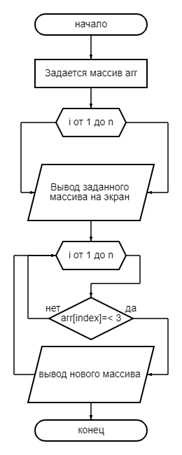

# FinalControlWork1
# Итоговая контрольная работа по основному блоку

Урок 1. Контрольная работа
Для полноценного выполнения проверочной работы необходимо:
1. Создать репозиторий на GitHub
2. Нарисовать блок-схему алгоритма (можно обойтись блок-схемой основной содержательной части, если вы выделяете её в отдельный метод)
3. Снабдить репозиторий оформленным текстовым описанием решения (файл README.md)
4. Написать программу, решающую поставленную задачу
5. Использовать контроль версий в работе над этим небольшим проектом (не должно быть так, что всё залито одним коммитом, как минимум этапы 2, 3, и 4 должны быть расположены в разных коммитах)

**Задача: Написать программу, которая из имеющегося массива строк формирует новый массив из строк, длина которых меньше, либо равна 3 символам. Первоначальный массив можно ввести с клавиатуры, либо задать на старте выполнения алгоритма. При решении не рекомендуется пользоваться коллекциями, лучше обойтись исключительно массивами.**

Примеры:
[“Hello”, “2”, “world”, “:-)”] → [“2”, “:-)”]
[“1234”, “1567”, “-2”, “computer science”] → [“-2”]
[“Russia”, “Denmark”, “Kazan”] → []*

## Описание решения

1.Создание репозитория на github

2.Блох схема алгоритма

Описание алгоритма
* На старте программы мы создаем массив строк с названием , который содержит некоторые строки.
* Затем выводим содержимое этого массива на экран для удобства пользователя.
* Создаем новый пустой массив строк 
* Далее, с помощью цикла for, проходим по каждой строке  и проверяем длину каждой строки.
* Если длина строки меньше или равна 3 символам, то добавляем эту строку в 
* После завершения цикла получаем новый массив , содержащий только те строки, которые удовлетворяют условию длины.
* Выводим содержимое нового массива newArray на экран.

Описание блок-схемы отображает последовательность шагов программы для задания размера массива, ввода элементов и вывода исходного и нового массивов.

1. Запросить у пользователя размер массива.
2. Создать пустой массив с заданным размером.
3. Заполнить массив значениями, полученными от пользователя.
4. Вывести исходный массив.
5. Создать новый пустой массив.
6. Пройти по каждому элементу исходного массива.
7. Если длина элемента не превышает 3 символа, добавить его в новый массив.
8. Вывести новый массив.
